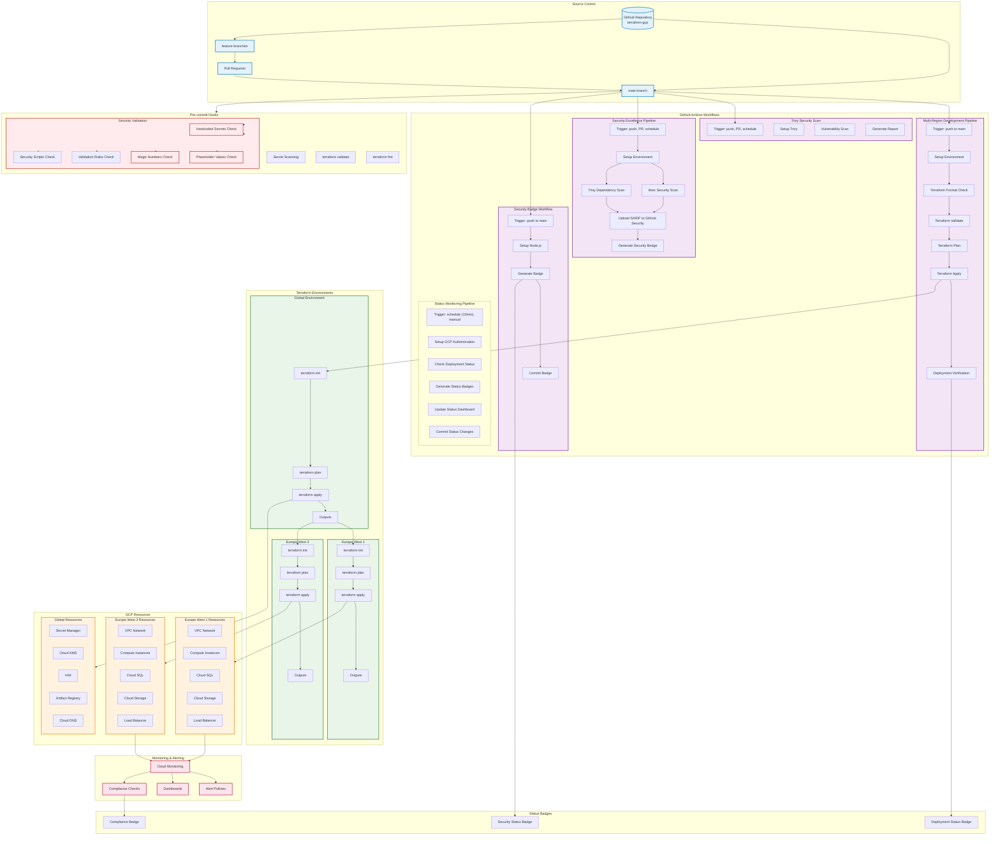

# Cataziza Platform - CI/CD Pipeline Architecture

## Complete CI/CD Pipeline Flow



## CI/CD Pipeline Details

###  **Workflow Triggers**

#### Multi-Region Development Pipeline
- **Trigger**: Push to `main` branch
- **Purpose**: Deploy infrastructure changes to GCP
- **Steps**:
  1. Setup environment (Terraform, gcloud)
  2. Format check (Europe West 1 & 3)
  3. Validation (Global, Europe West 1 & 3)
  4. Plan generation
  5. Apply changes (Global  Europe West 1  Europe West 3)
  6. Verification

#### Trivy Security Scan
- **Trigger**: Push, Pull Request, Schedule (daily)
- **Purpose**: Vulnerability scanning
- **Steps**:
  1. Setup Trivy
  2. Scan for vulnerabilities
  3. Generate security report
  4. Upload results to GitHub Security

#### Security Excellence Pipeline
- **Trigger**: Push, Pull Request, Schedule (daily)
- **Purpose**: Comprehensive security validation
- **Steps**:
  1. Setup environment
  2. Run tfsec security scan
  3. Run Trivy dependency scan
  4. Generate SARIF files
  5. Upload to GitHub Security
  6. Generate security badge

#### Security Badge Workflow
- **Trigger**: Push to `main` branch
- **Purpose**: Update dynamic security status badge
- **Steps**:
  1. Setup Node.js environment
  2. Generate security status badge
  3. Commit updated badge to repository

###  **Security Validation Checks**

#### Pre-commit Hooks
```bash
# Terraform formatting
terraform fmt -check -recursive

# Terraform validation
terraform validate

# Security validation
./scripts/security/validate-secrets.ps1
./scripts/security/validate-secrets.sh
```

#### Security Excellence Checks
- **Hardcoded Secrets**: Scan for exposed credentials
- **Placeholder Values**: Check for unresolved variables
- **Magic Numbers**: Identify hardcoded configuration values
- **Validation Rules**: Verify Terraform validation blocks
- **Security Scripts**: Ensure security tooling is present

###  **Security Status Levels**

#### EXCELLENT (Current Status)
-  All security checks pass
-  Zero hardcoded secrets
-  All values parameterized
-  Comprehensive validation rules
-  Complete security monitoring

#### GOOD
-  Minor security issues detected
-  Some hardcoded values present
-  Limited validation rules

#### FAIR
-  Multiple security issues
-  Several hardcoded values
-  Incomplete validation

#### POOR
-  Critical security issues
-  Many hardcoded secrets
-  No validation rules

###  **Deployment Strategy**

#### Blue-Green Deployment
1. **Blue Environment**: Current production
2. **Green Environment**: New deployment
3. **Switch**: Traffic routing change
4. **Rollback**: Quick revert capability

#### Multi-Region Deployment
1. **Global Resources**: Deployed first
2. **Primary Region**: Europe West 1
3. **Secondary Region**: Europe West 3
4. **Load Balancer**: Traffic distribution

###  **Monitoring & Alerting**

#### Real-time Monitoring
- **Infrastructure Health**: Compute, database, storage
- **Security Events**: Failed authentication, policy violations
- **Performance Metrics**: Response times, throughput
- **Compliance Status**: SOC 2, PCI DSS, HIPAA, ISO 27001, GDPR

#### Alert Policies
- **Security Incidents**: Immediate notification
- **Failed Authentication**: Multiple failed attempts
- **Compliance Violations**: Policy breaches
- **Resource Utilization**: High CPU, memory, disk usage

###  **Status Badges**

#### Dynamic Badge Generation
```javascript
// Security Status Badge
const securityStatus = calculateSecurityStatus();
const badgeUrl = `https://img.shields.io/badge/Security-${securityStatus}-${color}`;

// Deployment Status Badge
const deploymentStatus = checkDeploymentStatus();
const badgeUrl = `https://img.shields.io/badge/Deployment-${deploymentStatus}-${color}`;
```

#### Badge Updates
- **Automatic**: Triggered by CI/CD pipeline
- **Real-time**: Reflects current security status
- **Visual**: Color-coded status indicators
- **Persistent**: Stored in repository

## Pipeline Optimization

###  **Performance Improvements**
- **Parallel Execution**: Regional deployments run in parallel
- **Caching**: Terraform state and dependency caching
- **Incremental**: Only changed resources are updated
- **Validation**: Early failure detection

###  **Security Enhancements**
- **Secret Scanning**: Pre-commit and CI/CD validation
- **Dependency Scanning**: Vulnerability detection
- **Compliance Validation**: Automated compliance checks
- **Audit Logging**: Complete deployment audit trail

###  **Monitoring & Observability**
- **Pipeline Metrics**: Success rates, duration, failure points
- **Resource Monitoring**: Infrastructure health and performance
- **Security Monitoring**: Real-time threat detection
- **Compliance Monitoring**: Automated compliance validation
