# Cataziza Platform - Technical Architecture

## GCP Services Architecture

```mermaid
graph TB
    %% External Layer
    subgraph EXTERNAL["External Layer"]
        USERS[("Users")]
        INTERNET[("Internet")]
        CDN[("Cloud CDN")]
    end
    
    %% Global Layer
    subgraph GLOBAL_LAYER["Global Layer"]
        %% Load Balancing
        subgraph LB["Load Balancing"]
            GLB["Global Load Balancer<br/>google_compute_global_forwarding_rule"]
            URL_MAP["URL Map<br/>google_compute_url_map"]
            TARGET_PROXY["Target HTTP Proxy<br/>google_compute_target_http_proxy"]
            BACKEND_SERVICE["Backend Service<br/>google_compute_backend_service"]
        end
        
        %% DNS
        subgraph DNS["DNS"]
            DNS_ZONE["Managed DNS Zone<br/>google_dns_managed_zone"]
            DNS_RECORDS["DNS Records<br/>google_dns_record_set"]
        end
        
        %% IAM
        subgraph IAM["Identity & Access Management"]
            WORKLOAD_IDENTITY["Workload Identity Pool<br/>google_iam_workload_identity_pool"]
            WORKLOAD_PROVIDER["Workload Identity Provider<br/>google_iam_workload_identity_pool_provider"]
            CUSTOM_ROLE["Custom Role<br/>google_project_iam_custom_role"]
            SERVICE_ACCOUNTS["Service Accounts<br/>google_service_account"]
        end
        
        %% Secret Management
        subgraph SECRETS["Secret Management"]
            SECRET_MANAGER["Secret Manager<br/>google_secret_manager_secret"]
            SECRET_VERSIONS["Secret Versions<br/>google_secret_manager_secret_version"]
        end
        
        %% KMS
        subgraph KMS["Key Management"]
            KEYRING["Key Ring<br/>google_kms_key_ring"]
            CRYPTO_KEYS["Crypto Keys<br/>google_kms_crypto_key"]
            KEY_VERSIONS["Key Versions<br/>google_kms_crypto_key_version"]
        end
        
        %% Artifact Registry
        subgraph REGISTRY["Container Registry"]
            ARTIFACT_REGISTRY["Artifact Registry<br/>google_artifact_registry_repository"]
            CLEANUP_POLICIES["Cleanup Policies<br/>google_artifact_registry_repository_iam_policy"]
        end
    end
    
    %% Regional Layer - Europe West 1
    subgraph EU_WEST1["Europe West 1 (Primary)"]
        %% VPC
        subgraph VPC1["Virtual Private Cloud"]
            NETWORK["VPC Network<br/>google_compute_network"]
            
            %% Subnets
            subgraph SUBNETS1["Subnets"]
                WEB_SUBNET["Web Subnet<br/>google_compute_subnetwork<br/>10.0.1.0/24"]
                APP_SUBNET["App Subnet<br/>google_compute_subnetwork<br/>10.0.2.0/24"]
                DB_SUBNET["DB Subnet<br/>google_compute_subnetwork<br/>10.0.3.0/24"]
            end
            
            %% Firewall
            subgraph FIREWALL1["Firewall Rules"]
                WEB_FW["Web Firewall<br/>google_compute_firewall"]
                APP_FW["App Firewall<br/>google_compute_firewall"]
                DB_FW["DB Firewall<br/>google_compute_firewall"]
            end
        end
        
        %% Compute
        subgraph COMPUTE1["Compute Engine"]
            WEB_INSTANCES["Web Instances<br/>google_compute_instance<br/>cataziza-web-*"]
            APP_INSTANCES["App Instances<br/>google_compute_instance<br/>cataziza-app-*"]
        end
        
        %% Database
        subgraph DATABASE1["Cloud SQL"]
            SQL_INSTANCE["SQL Instance<br/>google_sql_database_instance<br/>cataziza-database-dev"]
            SQL_DATABASE["SQL Database<br/>google_sql_database"]
            SQL_USER["SQL User<br/>google_sql_user"]
        end
        
        %% Storage
        subgraph STORAGE1["Cloud Storage"]
            APP_BUCKET["App Data Bucket<br/>google_storage_bucket<br/>cataziza-customer-data-dev"]
            LOGS_BUCKET["Logs Bucket<br/>google_storage_bucket<br/>cataziza-application-logs-dev"]
            SECURITY_LOGS["Security Logs<br/>google_storage_bucket<br/>cataziza-security-logs-dev"]
        end
        
        %% Health Checks
        subgraph HEALTH1["Health Checks"]
            WEB_HEALTH["Web Health Check<br/>google_compute_health_check"]
            APP_HEALTH["App Health Check<br/>google_compute_health_check"]
            DB_HEALTH["DB Health Check<br/>google_compute_health_check"]
        end
    end
    
    %% Regional Layer - Europe West 3
    subgraph EU_WEST3["Europe West 3 (Secondary)"]
        %% VPC
        subgraph VPC3["Virtual Private Cloud"]
            NETWORK3["VPC Network<br/>google_compute_network"]
            
            %% Subnets
            subgraph SUBNETS3["Subnets"]
                WEB_SUBNET3["Web Subnet<br/>google_compute_subnetwork<br/>10.1.1.0/24"]
                APP_SUBNET3["App Subnet<br/>google_compute_subnetwork<br/>10.1.2.0/24"]
                DB_SUBNET3["DB Subnet<br/>google_compute_subnetwork<br/>10.1.3.0/24"]
            end
            
            %% Firewall
            subgraph FIREWALL3["Firewall Rules"]
                WEB_FW3["Web Firewall<br/>google_compute_firewall"]
                APP_FW3["App Firewall<br/>google_compute_firewall"]
                DB_FW3["DB Firewall<br/>google_compute_firewall"]
            end
        end
        
        %% Compute
        subgraph COMPUTE3["Compute Engine"]
            WEB_INSTANCES3["Web Instances<br/>google_compute_instance<br/>cataziza-web-*"]
            APP_INSTANCES3["App Instances<br/>google_compute_instance<br/>cataziza-app-*"]
        end
        
        %% Database
        subgraph DATABASE3["Cloud SQL"]
            SQL_INSTANCE3["SQL Instance<br/>google_sql_database_instance<br/>cataziza-database-dev"]
            SQL_DATABASE3["SQL Database<br/>google_sql_database"]
            SQL_USER3["SQL User<br/>google_sql_user"]
        end
        
        %% Storage
        subgraph STORAGE3["Cloud Storage"]
            APP_BUCKET3["App Data Bucket<br/>google_storage_bucket<br/>cataziza-customer-data-dev"]
            LOGS_BUCKET3["Logs Bucket<br/>google_storage_bucket<br/>cataziza-application-logs-dev"]
            SECURITY_LOGS3["Security Logs<br/>google_storage_bucket<br/>cataziza-security-logs-dev"]
        end
        
        %% Health Checks
        subgraph HEALTH3["Health Checks"]
            WEB_HEALTH3["Web Health Check<br/>google_compute_health_check"]
            APP_HEALTH3["App Health Check<br/>google_compute_health_check"]
            DB_HEALTH3["DB Health Check<br/>google_compute_health_check"]
        end
    end
    
    %% Status Monitoring Layer
    subgraph STATUS_MONITOR["Status Monitoring System"]
        %% Status Checking
        subgraph STATUS_CHECKING["Status Checking"]
            STATUS_SCRIPT["Status Checker<br/>scripts/status/check-deployment-status.sh"]
            STATUS_PS1["PowerShell Checker<br/>scripts/status/check-deployment-status.ps1"]
            BADGE_GENERATOR["Badge Generator<br/>scripts/status/generate-badges.js"]
        end
        
        %% Status Display
        subgraph STATUS_DISPLAY["Status Display"]
            DYNAMIC_BADGE["Dynamic Badge<br/>docs/status/badge.svg"]
            STATUS_DASHBOARD["Status Dashboard<br/>docs/status/index.html"]
            STATIC_BADGES["Static Badges<br/>live.svg, unalive.svg, partial.svg"]
        end
        
        %% Status Automation
        subgraph STATUS_AUTOMATION["Status Automation"]
            STATUS_WORKFLOW["GitHub Actions Workflow<br/>update-deployment-status.yml"]
            STATUS_SCHEDULE["Cron Schedule<br/>Every 15 minutes"]
            STATUS_TRIGGER["Manual Trigger<br/>workflow_dispatch"]
        end
    end
    
    %% Monitoring Layer
    subgraph MONITORING["Monitoring & Observability"]
        %% Cloud Monitoring
        subgraph CLOUD_MONITORING["Cloud Monitoring"]
            ALERT_POLICIES["Alert Policies<br/>google_monitoring_alert_policy"]
            DASHBOARDS["Dashboards<br/>google_monitoring_dashboard"]
            METRIC_DESCRIPTORS["Metric Descriptors<br/>google_monitoring_metric_descriptor"]
            UPTIME_CHECKS["Uptime Checks<br/>google_monitoring_uptime_check_config"]
        end
        
        %% Logging
        subgraph LOGGING["Logging"]
            LOG_SINKS["Log Sinks<br/>google_logging_project_sink"]
            LOG_METRICS["Log Metrics<br/>google_logging_metric"]
        end
        
        %% Compliance
        subgraph COMPLIANCE["Compliance"]
            COMPLIANCE_VALIDATION["Compliance Validation<br/>google_monitoring_alert_policy"]
            SECURITY_MONITORING["Security Monitoring<br/>google_monitoring_alert_policy"]
        end
    end
    
    %% CI/CD Layer
    subgraph CICD["CI/CD Pipeline"]
        GITHUB_ACTIONS["GitHub Actions"]
        TERRAFORM_PLAN["Terraform Plan"]
        TERRAFORM_APPLY["Terraform Apply"]
        SECURITY_SCANS["Security Scans"]
        TRIVY_SCAN["Trivy Scan"]
        TFSEC_SCAN["tfsec Scan"]
    end
    
    %% Connections
    USERS --> INTERNET
    INTERNET --> CDN
    CDN --> GLB
    
    GLB --> URL_MAP
    URL_MAP --> TARGET_PROXY
    TARGET_PROXY --> BACKEND_SERVICE
    
    BACKEND_SERVICE --> WEB_INSTANCES
    BACKEND_SERVICE --> WEB_INSTANCES3
    
    WEB_INSTANCES --> APP_INSTANCES
    WEB_INSTANCES3 --> APP_INSTANCES3
    
    APP_INSTANCES --> SQL_INSTANCE
    APP_INSTANCES3 --> SQL_INSTANCE3
    
    APP_INSTANCES --> APP_BUCKET
    APP_INSTANCES3 --> APP_BUCKET3
    
    APP_INSTANCES --> LOGS_BUCKET
    APP_INSTANCES3 --> LOGS_BUCKET3
    
    %% Global Services Connections
    APP_INSTANCES --> SECRET_MANAGER
    APP_INSTANCES3 --> SECRET_MANAGER
    
    SQL_INSTANCE --> KMS
    SQL_INSTANCE3 --> KMS
    APP_BUCKET --> KMS
    APP_BUCKET3 --> KMS
    
    APP_INSTANCES --> ARTIFACT_REGISTRY
    APP_INSTANCES3 --> ARTIFACT_REGISTRY
    
    %% Monitoring Connections
    WEB_INSTANCES --> ALERT_POLICIES
    APP_INSTANCES --> ALERT_POLICIES
    SQL_INSTANCE --> ALERT_POLICIES
    
    %% CI/CD Connections
    GITHUB_ACTIONS --> TERRAFORM_PLAN
    TERRAFORM_PLAN --> TERRAFORM_APPLY
    GITHUB_ACTIONS --> SECURITY_SCANS
    SECURITY_SCANS --> TRIVY_SCAN
    SECURITY_SCANS --> TFSEC_SCAN
    
    %% Styling
    classDef external fill:#e3f2fd,stroke:#0277bd,stroke-width:2px
    classDef global fill:#f3e5f5,stroke:#7b1fa2,stroke-width:2px
    classDef regional fill:#e8f5e8,stroke:#2e7d32,stroke-width:2px
    classDef monitoring fill:#fff3e0,stroke:#f57c00,stroke-width:2px
    classDef cicd fill:#fce4ec,stroke:#c2185b,stroke-width:2px
    
    class USERS,INTERNET,CDN external
    class GLB,URL_MAP,TARGET_PROXY,BACKEND_SERVICE,DNS,IAM,SECRETS,KMS,REGISTRY global
    class WEB_INSTANCES,APP_INSTANCES,SQL_INSTANCE,APP_BUCKET,LOGS_BUCKET regional
    class ALERT_POLICIES,DASHBOARDS,COMPLIANCE monitoring
    class GITHUB_ACTIONS,TERRAFORM_PLAN,SECURITY_SCANS cicd
```



## Terraform Resource Mapping

###  **Networking Resources**
```hcl
# Global Load Balancer
google_compute_global_forwarding_rule.forwarding_rule
google_compute_url_map.url_map
google_compute_target_http_proxy.target_http_proxy
google_compute_backend_service.backend_service

# VPC Networks
google_compute_network.vpc (per region)
google_compute_subnetwork.web_subnet
google_compute_subnetwork.app_subnet
google_compute_subnetwork.db_subnet

# Firewall Rules
google_compute_firewall.web_firewall
google_compute_firewall.app_firewall
google_compute_firewall.db_firewall
```

###  **Compute Resources**
```hcl
# Compute Instances
google_compute_instance.web_instances
google_compute_instance.app_instances

# Health Checks
google_compute_health_check.web_health_check
google_compute_health_check.app_health_check
google_compute_health_check.db_health_check
```

###  **Database Resources**
```hcl
# Cloud SQL
google_sql_database_instance.database
google_sql_database.database
google_sql_user.database_user
```

###  **Storage Resources**
```hcl
# Cloud Storage
google_storage_bucket.app_data_bucket
google_storage_bucket.logs_bucket
google_storage_bucket.security_logs

# Storage IAM
google_storage_bucket_iam_policy.app_data_bucket_policy
google_storage_bucket_iam_policy.logs_bucket_policy
```

###  **Security Resources**
```hcl
# Secret Manager
google_secret_manager_secret.api_key_secret
google_secret_manager_secret.database_password_secret
google_secret_manager_secret.vpn_shared_secret

# KMS
google_kms_key_ring.keyring
google_kms_crypto_key.data_encryption_key
google_kms_crypto_key.signing_key

# IAM
google_iam_workload_identity_pool.github_actions_pool
google_iam_workload_identity_pool_provider.github_actions_provider
google_project_iam_custom_role.terraform_custom_role_v2
```

###  **Monitoring Resources**
```hcl
# Cloud Monitoring
google_monitoring_alert_policy.security_incidents
google_monitoring_alert_policy.compliance_violations
google_monitoring_dashboard.security_dashboard
google_monitoring_dashboard.compliance_dashboard

# Logging
google_logging_project_sink.security_logs_sink
google_logging_metric.security_events_metric
```

###  **Container Registry**
```hcl
# Artifact Registry
google_artifact_registry_repository.application_images
google_artifact_registry_repository.base_images
```

## Security Architecture

###  **Defense in Depth**
1. **Network Security**: VPC with private subnets, firewall rules
2. **Identity Security**: IAM roles, service accounts, workload identity
3. **Data Security**: KMS encryption, secret management
4. **Application Security**: Container scanning, vulnerability management
5. **Monitoring Security**: Real-time alerting, compliance validation

###  **Encryption Strategy**
- **Data at Rest**: KMS customer-managed encryption keys
- **Data in Transit**: TLS 1.3 for all communications
- **Secrets**: Secret Manager with automatic rotation
- **Keys**: Hardware Security Module (HSM) backed keys

###  **Compliance Framework**
- **SOC 2**: Security, availability, processing integrity
- **PCI DSS**: Payment card industry data security
- **HIPAA**: Healthcare data protection
- **ISO 27001**: Information security management
- **GDPR**: European data protection regulation

## High Availability Design

###  **Multi-Region Strategy**
- **Active-Active**: Both regions serve traffic simultaneously
- **Load Distribution**: Global load balancer distributes traffic
- **Data Replication**: Cross-region data synchronization
- **Failover**: Automatic failover in case of regional outage

###  **Performance Optimization**
- **CDN**: Cloud CDN for static content delivery
- **Caching**: Application-level caching strategies
- **Database**: Read replicas for improved performance
- **Monitoring**: Real-time performance metrics

## Cost Optimization

###  **Resource Optimization**
- **Right-sizing**: Appropriate instance types for workloads
- **Auto-scaling**: Dynamic resource allocation based on demand
- **Lifecycle Policies**: Automated data lifecycle management
- **Reserved Instances**: Committed use discounts for predictable workloads

###  **Monitoring & Alerting**
- **Cost Alerts**: Budget alerts and cost anomaly detection
- **Resource Utilization**: Monitoring and optimization recommendations
- **Waste Detection**: Identifying unused or underutilized resources
