# Terratest Integration Architecture

## Complete Testing Framework Architecture

```mermaid
graph TB
    %% Test Execution Layer
    subgraph TEST_EXECUTION["Test Execution Layer"]
        UNIT_TESTS["Unit Tests<br/>Module Level"]
        INTEGRATION_TESTS["Integration Tests<br/>Environment Level"]
        E2E_TESTS["End-to-End Tests<br/>Full Stack"]
    end
    
    %% Test Categories
    subgraph TEST_CATEGORIES["Test Categories"]
        %% Unit Tests
        subgraph UNIT_CATEGORIES["Unit Test Categories"]
            COMPUTE_UNIT["Compute Module<br/>Instances, MIGs, Load Balancers"]
            DATABASE_UNIT["Database Module<br/>Cloud SQL, Redis, Users"]
            NETWORKING_UNIT["Networking Module<br/>VPC, Subnets, Firewalls"]
            SECURITY_UNIT["Security Module<br/>IAM, KMS, Secret Manager"]
            STORAGE_UNIT["Storage Module<br/>Buckets, Lifecycle, IAM"]
            MONITORING_UNIT["Monitoring Module<br/>Alerts, Dashboards, SLOs"]
            DATA_UNIT["Data Module<br/>BigQuery, Pub/Sub, Dataflow"]
        end
        
        %% Integration Tests
        subgraph INTEGRATION_CATEGORIES["Integration Test Categories"]
            MULTI_REGION["Multi-Region Integration<br/>Cross-region connectivity"]
            SECURITY_INTEGRATION["Security Integration<br/>Compliance validation"]
            PERFORMANCE_INTEGRATION["Performance Integration<br/>Load testing, scaling"]
            DISASTER_RECOVERY["Disaster Recovery<br/>Failover, backup, restore"]
        end
        
        %% E2E Tests
        subgraph E2E_CATEGORIES["E2E Test Categories"]
            FULL_STACK["Full Stack Testing<br/>Complete application flow"]
            COMPLIANCE_E2E["Compliance E2E<br/>SOC 2, PCI DSS, HIPAA"]
            PERFORMANCE_E2E["Performance E2E<br/>Response times, throughput"]
            SECURITY_E2E["Security E2E<br/>Penetration testing, audits"]
        end
    end
    
    %% Test Infrastructure
    subgraph TEST_INFRASTRUCTURE["Test Infrastructure"]
        %% Test Helpers
        subgraph TEST_HELPERS["Test Helpers"]
            GCP_HELPERS["GCP Helpers<br/>Resource management, cleanup"]
            TERRAFORM_HELPERS["Terraform Helpers<br/>Deployment, validation"]
            FIXTURE_HELPERS["Fixture Helpers<br/>Test data, environments"]
            REPORTING_HELPERS["Reporting Helpers<br/>Results, metrics, alerts"]
        end
        
        %% Test Data
        subgraph TEST_DATA["Test Data Management"]
            ENVIRONMENT_FIXTURES["Environment Fixtures<br/>Dev, staging, prod configs"]
            RESOURCE_FIXTURES["Resource Fixtures<br/>Test resource templates"]
            DATA_FIXTURES["Data Fixtures<br/>Sample data, test datasets"]
            MOCK_DATA["Mock Data<br/>External service mocks"]
        end
        
        %% Test Utilities
        subgraph TEST_UTILITIES["Test Utilities"]
            PARALLEL_EXECUTION["Parallel Execution<br/>Concurrent test runs"]
            TEST_CACHING["Test Caching<br/>Resource reuse, optimization"]
            CLEANUP_UTILITIES["Cleanup Utilities<br/>Resource cleanup, teardown"]
            MONITORING_UTILITIES["Monitoring Utilities<br/>Test metrics, reporting"]
        end
    end
    
    %% CI/CD Integration
    subgraph CICD_INTEGRATION["CI/CD Integration"]
        %% GitHub Actions
        subgraph GITHUB_ACTIONS["GitHub Actions Workflows"]
            UNIT_WORKFLOW["Unit Test Workflow<br/>Module validation"]
            INTEGRATION_WORKFLOW["Integration Test Workflow<br/>Environment validation"]
            E2E_WORKFLOW["E2E Test Workflow<br/>Full stack validation"]
            REPORTING_WORKFLOW["Reporting Workflow<br/>Test results, metrics"]
        end
        
        %% Test Execution
        subgraph TEST_EXECUTION_JOBS["Test Execution Jobs"]
            PARALLEL_JOBS["Parallel Jobs<br/>Concurrent test execution"]
            SEQUENTIAL_JOBS["Sequential Jobs<br/>Dependent test execution"]
            CONDITIONAL_JOBS["Conditional Jobs<br/>Environment-specific tests"]
            CLEANUP_JOBS["Cleanup Jobs<br/>Resource cleanup, teardown"]
        end
    end
    
    %% GCP Test Environment
    subgraph GCP_TEST_ENV["GCP Test Environment"]
        %% Test Projects
        subgraph TEST_PROJECTS["Test Projects"]
            UNIT_PROJECT["Unit Test Project<br/>Module testing"]
            INTEGRATION_PROJECT["Integration Test Project<br/>Environment testing"]
            E2E_PROJECT["E2E Test Project<br/>Full stack testing"]
        end
        
        %% Test Resources
        subgraph TEST_RESOURCES["Test Resources"]
            COMPUTE_RESOURCES["Compute Resources<br/>Instances, MIGs, Load Balancers"]
            DATABASE_RESOURCES["Database Resources<br/>Cloud SQL, Redis, Users"]
            NETWORKING_RESOURCES["Networking Resources<br/>VPC, Subnets, Firewalls"]
            SECURITY_RESOURCES["Security Resources<br/>IAM, KMS, Secret Manager"]
            STORAGE_RESOURCES["Storage Resources<br/>Buckets, Lifecycle, IAM"]
            MONITORING_RESOURCES["Monitoring Resources<br/>Alerts, Dashboards, SLOs"]
        end
    end
    
    %% Test Reporting
    subgraph TEST_REPORTING["Test Reporting"]
        %% Reports
        subgraph REPORTS["Test Reports"]
            UNIT_REPORTS["Unit Test Reports<br/>Module validation results"]
            INTEGRATION_REPORTS["Integration Test Reports<br/>Environment validation results"]
            E2E_REPORTS["E2E Test Reports<br/>Full stack validation results"]
            COMPLIANCE_REPORTS["Compliance Reports<br/>Security, audit results"]
        end
        
        %% Metrics
        subgraph METRICS["Test Metrics"]
            COVERAGE_METRICS["Coverage Metrics<br/>Test coverage, code coverage"]
            PERFORMANCE_METRICS["Performance Metrics<br/>Test execution time, resource usage"]
            QUALITY_METRICS["Quality Metrics<br/>Test reliability, maintainability"]
            BUSINESS_METRICS["Business Metrics<br/>Risk reduction, cost optimization"]
        end
    end
    
    %% Connections
    UNIT_TESTS --> COMPUTE_UNIT
    UNIT_TESTS --> DATABASE_UNIT
    UNIT_TESTS --> NETWORKING_UNIT
    UNIT_TESTS --> SECURITY_UNIT
    UNIT_TESTS --> STORAGE_UNIT
    UNIT_TESTS --> MONITORING_UNIT
    UNIT_TESTS --> DATA_UNIT
    
    INTEGRATION_TESTS --> MULTI_REGION
    INTEGRATION_TESTS --> SECURITY_INTEGRATION
    INTEGRATION_TESTS --> PERFORMANCE_INTEGRATION
    INTEGRATION_TESTS --> DISASTER_RECOVERY
    
    E2E_TESTS --> FULL_STACK
    E2E_TESTS --> COMPLIANCE_E2E
    E2E_TESTS --> PERFORMANCE_E2E
    E2E_TESTS --> SECURITY_E2E
    
    UNIT_TESTS --> GCP_HELPERS
    INTEGRATION_TESTS --> TERRAFORM_HELPERS
    E2E_TESTS --> FIXTURE_HELPERS
    
    GCP_HELPERS --> ENVIRONMENT_FIXTURES
    TERRAFORM_HELPERS --> RESOURCE_FIXTURES
    FIXTURE_HELPERS --> DATA_FIXTURES
    
    UNIT_WORKFLOW --> UNIT_PROJECT
    INTEGRATION_WORKFLOW --> INTEGRATION_PROJECT
    E2E_WORKFLOW --> E2E_PROJECT
    
    UNIT_PROJECT --> COMPUTE_RESOURCES
    INTEGRATION_PROJECT --> DATABASE_RESOURCES
    E2E_PROJECT --> NETWORKING_RESOURCES
    
    UNIT_TESTS --> UNIT_REPORTS
    INTEGRATION_TESTS --> INTEGRATION_REPORTS
    E2E_TESTS --> E2E_REPORTS
    
    UNIT_REPORTS --> COVERAGE_METRICS
    INTEGRATION_REPORTS --> PERFORMANCE_METRICS
    E2E_REPORTS --> QUALITY_METRICS
    COMPLIANCE_REPORTS --> BUSINESS_METRICS
    
    %% Styling
    classDef testExecution fill:#e3f2fd,stroke:#0277bd,stroke-width:2px
    classDef testCategories fill:#f3e5f5,stroke:#7b1fa2,stroke-width:2px
    classDef testInfrastructure fill:#e8f5e8,stroke:#2e7d32,stroke-width:2px
    classDef cicdIntegration fill:#fff3e0,stroke:#f57c00,stroke-width:2px
    classDef gcpTestEnv fill:#fce4ec,stroke:#c2185b,stroke-width:2px
    classDef testReporting fill:#ffebee,stroke:#c62828,stroke-width:2px
    
    class UNIT_TESTS,INTEGRATION_TESTS,E2E_TESTS testExecution
    class COMPUTE_UNIT,DATABASE_UNIT,NETWORKING_UNIT,SECURITY_UNIT,STORAGE_UNIT,MONITORING_UNIT,DATA_UNIT testCategories
    class GCP_HELPERS,TERRAFORM_HELPERS,FIXTURE_HELPERS,REPORTING_HELPERS testInfrastructure
    class UNIT_WORKFLOW,INTEGRATION_WORKFLOW,E2E_WORKFLOW,REPORTING_WORKFLOW cicdIntegration
    class UNIT_PROJECT,INTEGRATION_PROJECT,E2E_PROJECT gcpTestEnv
    class UNIT_REPORTS,INTEGRATION_REPORTS,E2E_REPORTS,COMPLIANCE_REPORTS testReporting
```

## Test Execution Flow

```mermaid
graph LR
    %% Test Trigger
    TRIGGER["Code Change<br/>Push/PR"]
    
    %% Test Execution
    UNIT_EXECUTION["Unit Tests<br/>Module Validation"]
    INTEGRATION_EXECUTION["Integration Tests<br/>Environment Validation"]
    E2E_EXECUTION["E2E Tests<br/>Full Stack Validation"]
    
    %% Test Results
    UNIT_RESULTS["Unit Results<br/>Pass/Fail"]
    INTEGRATION_RESULTS["Integration Results<br/>Pass/Fail"]
    E2E_RESULTS["E2E Results<br/>Pass/Fail"]
    
    %% Decision Points
    UNIT_DECISION{"Unit Tests<br/>Pass?"}
    INTEGRATION_DECISION{"Integration Tests<br/>Pass?"}
    E2E_DECISION{"E2E Tests<br/>Pass?"}
    
    %% Actions
    DEPLOY["Deploy to<br/>Production"]
    ROLLBACK["Rollback<br/>Changes"]
    FIX_ISSUES["Fix Issues<br/>and Retry"]
    
    %% Flow
    TRIGGER --> UNIT_EXECUTION
    UNIT_EXECUTION --> UNIT_RESULTS
    UNIT_RESULTS --> UNIT_DECISION
    
    UNIT_DECISION -->|Pass| INTEGRATION_EXECUTION
    UNIT_DECISION -->|Fail| FIX_ISSUES
    
    INTEGRATION_EXECUTION --> INTEGRATION_RESULTS
    INTEGRATION_RESULTS --> INTEGRATION_DECISION
    
    INTEGRATION_DECISION -->|Pass| E2E_EXECUTION
    INTEGRATION_DECISION -->|Fail| FIX_ISSUES
    
    E2E_EXECUTION --> E2E_RESULTS
    E2E_RESULTS --> E2E_DECISION
    
    E2E_DECISION -->|Pass| DEPLOY
    E2E_DECISION -->|Fail| ROLLBACK
    
    FIX_ISSUES --> TRIGGER
    
    %% Styling
    classDef trigger fill:#e3f2fd,stroke:#0277bd,stroke-width:2px
    classDef execution fill:#f3e5f5,stroke:#7b1fa2,stroke-width:2px
    classDef results fill:#e8f5e8,stroke:#2e7d32,stroke-width:2px
    classDef decision fill:#fff3e0,stroke:#f57c00,stroke-width:2px
    classDef action fill:#fce4ec,stroke:#c2185b,stroke-width:2px
    
    class TRIGGER trigger
    class UNIT_EXECUTION,INTEGRATION_EXECUTION,E2E_EXECUTION execution
    class UNIT_RESULTS,INTEGRATION_RESULTS,E2E_RESULTS results
    class UNIT_DECISION,INTEGRATION_DECISION,E2E_DECISION decision
    class DEPLOY,ROLLBACK,FIX_ISSUES action
```

## Test Coverage Matrix

| Test Type | Module | Coverage | Frequency | Duration | Dependencies |
|-----------|--------|----------|-----------|----------|--------------|
| **Unit Tests** | | | | | |
| | Compute | 95% | Every PR | 5 min | None |
| | Database | 90% | Every PR | 3 min | None |
| | Networking | 95% | Every PR | 4 min | None |
| | Security | 90% | Every PR | 3 min | None |
| | Storage | 85% | Every PR | 2 min | None |
| | Monitoring | 80% | Every PR | 2 min | None |
| | Data | 85% | Every PR | 3 min | None |
| **Integration Tests** | | | | | |
| | Multi-Region | 90% | Every PR | 15 min | Unit Tests |
| | Security | 85% | Every PR | 10 min | Unit Tests |
| | Performance | 80% | Every PR | 20 min | Unit Tests |
| | Disaster Recovery | 75% | Every PR | 25 min | Unit Tests |
| **E2E Tests** | | | | | |
| | Full Stack | 95% | Main branch | 45 min | Integration Tests |
| | Compliance | 90% | Main branch | 30 min | Integration Tests |
| | Performance | 85% | Main branch | 60 min | Integration Tests |
| | Security | 90% | Main branch | 40 min | Integration Tests |

## Implementation Benefits

### **Quality Assurance**
- **Automated Validation**: 100% of infrastructure changes validated
- **Regression Testing**: Early detection of breaking changes
- **Compliance Validation**: Automated security and compliance testing
- **Performance Validation**: Automated performance and scaling testing

### **Risk Mitigation**
- **Production Safety**: 100% test validation before deployment
- **Disaster Recovery**: Automated failover and recovery testing
- **Security Validation**: Continuous security and compliance validation
- **Cost Control**: Automated cost optimization and monitoring

### **Process Improvement**
- **Deployment Confidence**: 100% test validation before deployment
- **Issue Detection**: 90% of issues caught in testing
- **Recovery Time**: <5 minutes for test failures
- **Documentation**: 100% of tests documented and maintained

### **Business Value**
- **Risk Reduction**: 80% reduction in production issues
- **Deployment Speed**: 50% faster deployment cycles
- **Cost Optimization**: 20% reduction in infrastructure costs
- **Compliance**: 100% compliance framework coverage

## Next Steps

1. **Review Implementation Plan**: Review the detailed implementation plan
2. **Set Up Test Environment**: Create test GCP projects and resources
3. **Implement Phase 1**: Start with foundation setup and unit tests
4. **Monitor Progress**: Track implementation progress and metrics
5. **Iterate and Improve**: Continuously improve test coverage and quality

This comprehensive Terratest integration will significantly enhance the terraform-gcp project's reliability, maintainability, and deployment confidence while providing robust testing coverage for all infrastructure components.
